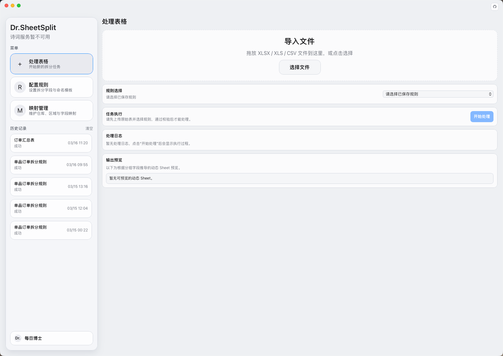
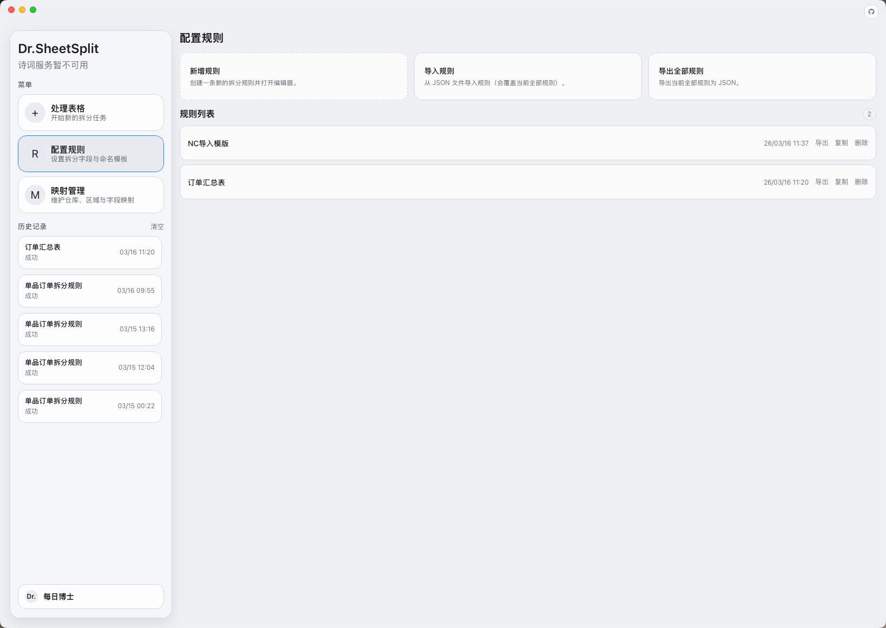
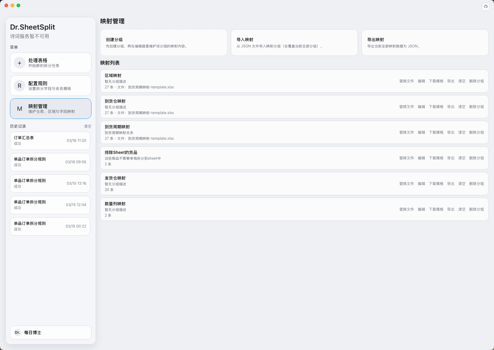
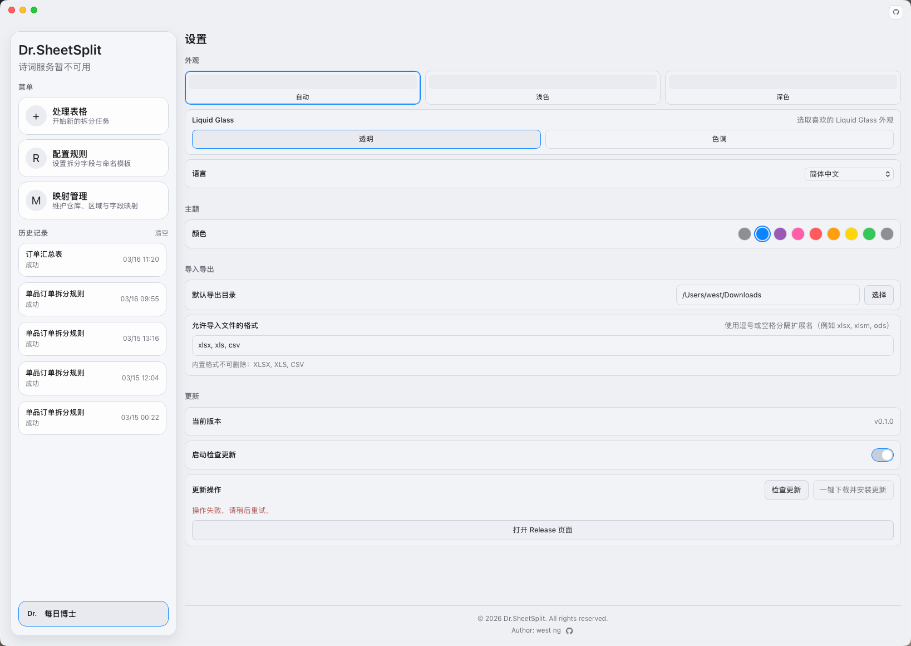

# Dr.SheetSplit

[](./LICENSE)

Dr.SheetSplit 是一个基于 **Tauri + Vue 3 + TypeScript + Python** 的桌面端表格拆分工具。
你可以通过可视化规则把一个源表按业务条件拆分为多个工作表/工作簿，并支持映射转换、表达式计算、本地持久化和自动更新。


## 目录

- [功能特性](#功能特性)
- [技术栈](#技术栈)
- [安装与运行](#安装与运行)
- [打包发布](#打包发布)
- [规则引擎能力](#规则引擎能力)
- [映射数据格式](#映射数据格式)
- [数据存储](#数据存储)
- [自动更新](#自动更新)
- [软件截图](#软件截图)
- [项目结构](#项目结构)
- [常见问题](#常见问题)
- [贡献指南](#贡献指南)
- [开源协议](#开源协议)

## 功能特性

- 可视化规则配置：创建、编辑、导入、导出规则
- 动态拆分：按分组字段输出多个 Sheet
- 映射管理：分组维护映射，支持 JSON/CSV/XLSX 导入导出
- 多种取值模式：来源字段、固定值、映射转换、多条件映射、聚合、表达式、日期格式化等
- 本地持久化：规则、映射、历史记录、界面设置
- 自动更新：检查更新、下载并安装
- 多语言：简体中文 / English

## 技术栈

- 前端：Vue 3 + TypeScript + Vite + Vue Router + Vue I18n
- 桌面端：Tauri 2
- 规则引擎：Python（`src-tauri/python/transform_engine.py`）
- 表格处理：SheetJS (`xlsx`)
- 本地存储：
  - 规则：SQLite（`rules.db`）
  - 历史：SQLite（`history.db`）
  - 映射：Tauri Store（`settings.json`）

## 安装与运行

### 环境要求

- Node.js 18+（建议 20+）
- pnpm
- Rust（含 cargo）
- Tauri 系统依赖（按官方文档安装）
- Python 3（仅开发调试可选；发布包使用内置运行时）

可选环境变量（开发调试时指定解释器）：

```bash
export DR_SHEETSPLIT_PYTHON=/usr/local/bin/python3
```

### 安装依赖

```bash
pnpm install
```

### 本地开发

```bash
pnpm tauri dev
```

## 打包发布

```bash
pnpm build
pnpm tauri build
```

发布包采用内置 Python 运行时（最终用户无需安装 Python）。
打包前请放置对应平台可执行文件：

- macOS: `src-tauri/python/runtime/macos/bin/python3`
- Windows: `src-tauri/python/runtime/windows/python.exe`

说明：

- `release` 构建会校验上述路径，缺失时会直接失败
- `dev` 模式仍允许回退系统 Python

## 规则引擎能力

当前支持的输出取值方式：

- `source`：来源字段
- `constant`：固定值
- `mapping`：单字段映射转换
- `mapping_multi`：多条件映射转换（`字段1+字段2+...`）
- `conditional_target`：条件字段分流
- `aggregate_sum`：组内求和
- `aggregate_sum_divide`：逐行相除后求和
- `aggregate_join`：组内拼接
- `copy_output`：复制已产出字段
- `format_date`：日期格式化
- `expression`：表达式计算

表达式示例：

```text
sum("采购数量") / sum("采购规格")
join_unique("采购单号", "\\n")
```

详细说明见：[RULE_ENGINE.md](./RULE_ENGINE.md)

## 映射数据格式

支持导入：

- JSON
- CSV
- XLSX / XLS

要求：

- 需要可识别 `source` / `target` 列
- JSON 支持：
  - 数组对象：`[{ "source": "A", "target": "B" }]`
  - 键值对象：`{ "A": "B" }`

备注：首次安装默认没有预置映射数据，映射内容由用户自行维护。

## 数据存储

- 规则：`rules.db`
- 历史：`history.db`
- 映射：`settings.json`（`mappingGroups`）
- 外观/语言/导入导出设置：`localStorage`

## 自动更新

已接入 `@tauri-apps/plugin-updater`，默认更新地址：

- <https://github.com/westng/Dr.SheetSplit/releases/latest/download/latest.json>

## 软件截图

将截图放到 `screenshots/` 后，README 会自动显示。当前使用以下文件名：






## 项目结构

```text
.
├─ src/                         # 前端源码
│  ├─ components/               # 业务组件
│  ├─ pages/                    # 主页面与编辑器页面
│  ├─ services/process/         # 处理流程编排
│  ├─ store/                    # 状态与本地存储访问
│  ├─ utils/                    # 校验、解析等工具
│  ├─ composables/              # 组合式逻辑
│  └─ locales/                  # i18n 文案
├─ src-tauri/
│  ├─ src/lib.rs                # Tauri 命令与后端桥接
│  ├─ python/                   # Python 引擎与运行时资源
│  └─ tauri.conf.json           # 打包、窗口、更新配置
├─ README.md
└─ LICENSE
```

## 常见问题

### 1. `pnpm tauri dev` 启动失败，提示端口占用

通常是已有 Vite/Tauri 进程占用 `1420`，结束旧进程后重试。

### 2. 发布包运行时报 Python 相关错误

优先检查打包时是否包含内置运行时路径（见[打包发布](#打包发布)）。

### 3. 导入文件不可选

检查「设置 -> 导入导出 -> 允许导入文件格式」是否包含对应扩展名。

## 贡献指南

欢迎通过 Issue 和 Pull Request 参与贡献。

### 提交 Issue

提交前请先搜索是否已有相同问题。新建 Issue 时建议包含：

- 问题描述与预期行为
- 复现步骤
- 运行环境（操作系统、应用版本）
- 错误日志或截图（如有）

### 开发流程

1. Fork 仓库并创建分支（示例：`feat/multi-field-mapping`、`fix/history-scrollbar`）
2. 安装依赖：`pnpm install`
3. 本地开发：`pnpm tauri dev`
4. 构建检查：`pnpm build`
5. 提交代码并发起 Pull Request

### 提交规范

建议使用 Conventional Commits，例如：

- `feat(rules): add multi-field mapping mode`
- `fix(ui): hide sidebar history scrollbar`
- `docs(readme): improve contribution guide`

### Pull Request 要求

- 标题清晰说明变更目标
- 描述包含：变更内容、原因、影响范围
- 涉及 UI 调整时附截图或录屏
- 通过基础构建检查（至少 `pnpm build`）
- 保持单一主题，避免把无关改动混入同一个 PR

### 安全问题

若发现安全漏洞，请不要公开提交 Issue。请通过仓库维护者联系方式私下通知。

### 行为准则

请保持尊重、专业、可协作的沟通方式。

## 开源协议

本项目采用 **The Unlicense**，详见 [LICENSE](./LICENSE)。
